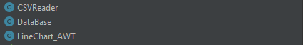
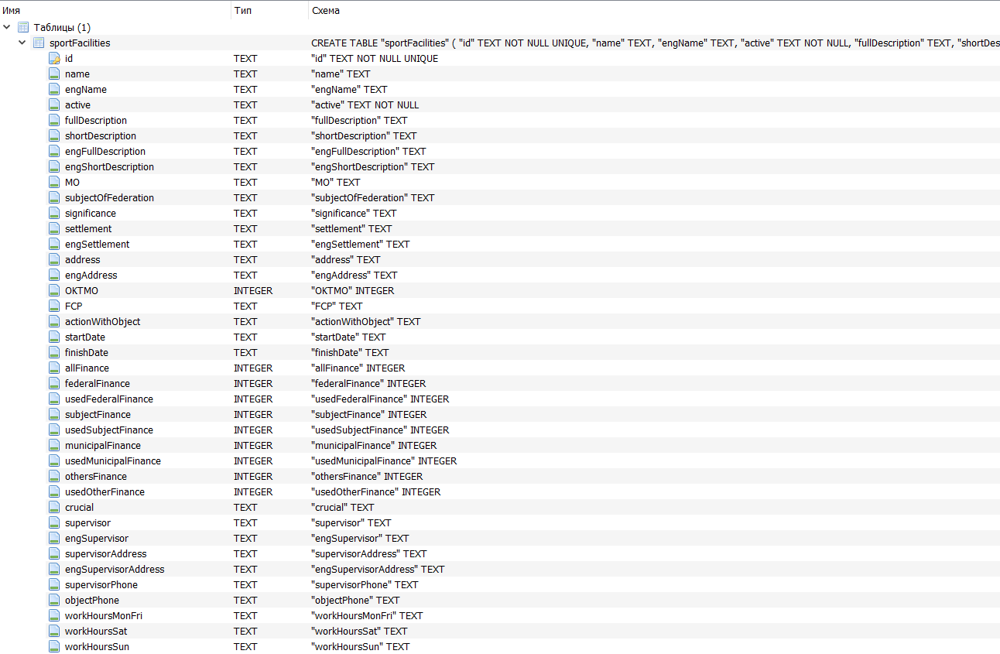
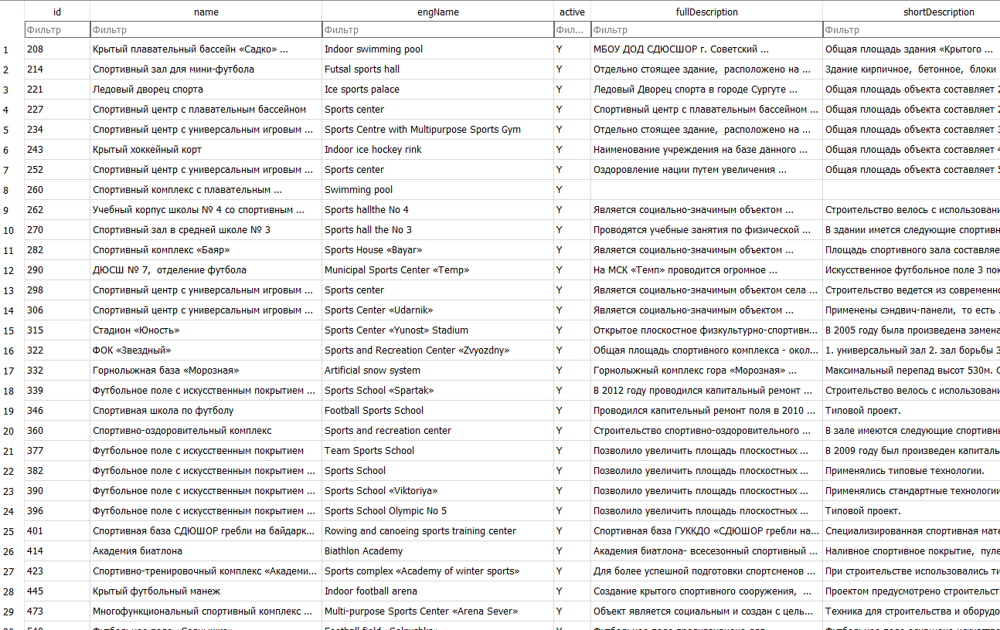
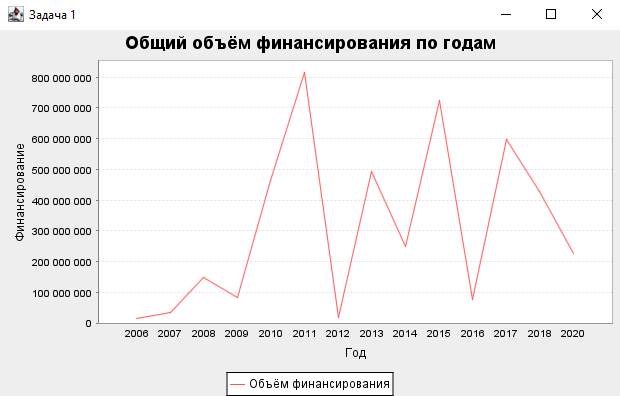
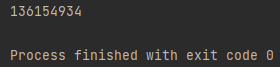
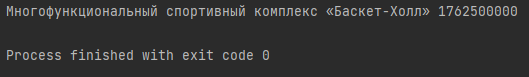

<h1>Итоговый семестровый проект</h1>
Изначально был разработан набор классов для работы с CSV и базой данных SQLite.

Был изучен и распарсен CSV-файл, после чего создана база-данных.

Далее был создан метод Main.fillingDatabase, который автоматически заполнил базу данных информацией из CSV-файла.

Затем я приступила к выполнению заданий, создав по классу для каждой задачи.

Для всех заданий выполнялись необходимые запросы к базе данных.

Результатом выполнения первой задачи был график:

Результатом выполнения второй задачи был вывод в консоль среднего финансирования за определённый год:

А результатом выполнения третьей задачи было нахождение объекта с самым объёмным финансированием:

